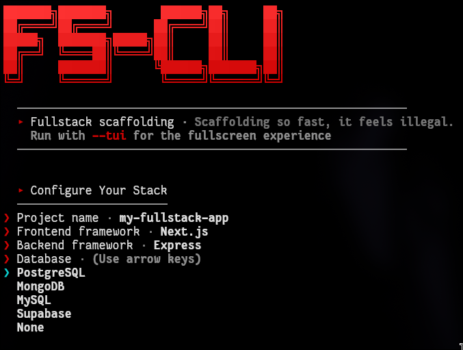
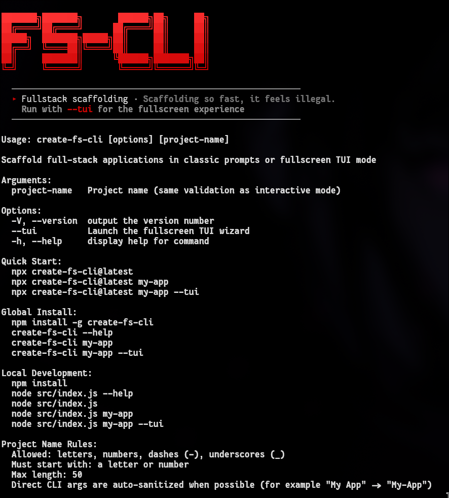

# create-fs-cli

Production-ready CLI for scaffolding full-stack apps in either classic prompts or fullscreen TUI mode.

## npm

- Package page: [create-fs-cli on npm](https://www.npmjs.com/package/create-fs-cli)
- Install globally: `npm install -g create-fs-cli`
- Run without install: `npx create-fs-cli@latest`

## Requirements

- Node.js 18+
- npm
- git (recommended)

## Quick Start

### 1) Use without global install (recommended)

```bash
# Classic interactive mode
npx create-fs-cli@latest

# Pass project name directly (like create-next-app)
npx create-fs-cli@latest my-app

# Pass project name + frontend language directly
npx create-fs-cli@latest my-app ts
npx create-fs-cli@latest my-app js

# Fullscreen TUI mode (red/white interface)
npx create-fs-cli@latest --tui
npx create-fs-cli@latest my-app --tui
```

### 2) Global install (production workflow)

```bash
npm install -g create-fs-cli

create-fs-cli --help
create-fs-cli
create-fs-cli my-app
create-fs-cli my-app ts
create-fs-cli --tui
create-fs-cli my-app --tui
create-fs-cli my-app ts --tui
```

### 3) Local development (this repository)

```bash
git clone https://github.com/HemanthRaj0C/fullstack-cli.git
cd fullstack-cli
npm install

# Run from repo root
npm run dev
node src/index.js
node src/index.js my-app
node src/index.js my-app ts
node src/index.js --tui
node src/index.js my-app --tui
node src/index.js my-app ts --tui

# If you cd into src/
node index.js
node index.js my-app
```

### 4) Test local build as a global command

```bash
npm link
create-fs-cli --help
create-fs-cli --tui
```

## Demo Video

[](recordings/demo_video.mp4)

Direct link: [recordings/demo_video.mp4](recordings/demo_video.mp4)

## Screenshots

### TUI Mode


### Classic Mode (Non-TUI)



### Help Output



## Help Commands

```bash
create-fs-cli --help

# Local development equivalents
node src/index.js --help
```

## Project Name Rules

- Allowed characters: letters, numbers, dashes (`-`), underscores (`_`).
- Must start with a letter or number.
- Maximum length: 50 characters.
- Interactive input validates immediately.
- Direct CLI names are auto-sanitized when possible.
- Optional second positional arg accepts frontend language (`js` or `ts`).

Examples:

```bash
npx create-fs-cli@latest "My App"      # sanitized to My-App
npx create-fs-cli@latest "app@2026"    # sanitized to app2026
```

If a name cannot be sanitized into a valid value, the CLI exits with a clear error and suggestion.

## Positional Frontend Language Argument

You can pass frontend language directly as the second positional argument:

```bash
create-fs-cli my-app ts
create-fs-cli my-app js
```

Accepted values:

- `js` or `javascript`
- `ts` or `typescript`

Argument order:

```bash
create-fs-cli [project-name] [frontend-language]
```

## UI Modes

- `--tui`: fullscreen wizard with guided selections, overwrite confirmation, and live generation progress.
- Classic mode: standard terminal prompts.
- Both modes include explicit frontend language selection (`JavaScript` or `TypeScript`).

Both modes enforce the same stack validation rules and generation behavior.

## Features

- Fullscreen TUI and classic prompt mode.
- Frontend: Next.js, React + Vite, SvelteKit (`JavaScript` or `TypeScript`).
- Backend: Next.js API Routes (integrated), Express, Fastify, FastAPI.
- Database: PostgreSQL, MongoDB, MySQL, Supabase, None.
- Safe overwrite confirmation before deleting existing directories.
- BackendStatus component auto-injection for frontend health visibility.
- Preflight checks before generation.

## Valid Stack Matrix

- `Next.js API Routes (integrated)` is available only when frontend is `Next.js`.
- With `Next.js API Routes`, database is forced to `None`.
- `FastAPI + MySQL` is not supported by templates; selection is normalized to `PostgreSQL` with warning.

## Generated Structure

```text
my-project/
├── frontend/
│   ├── src/components/
│   │   └── BackendStatus
│   └── package.json
├── backend/              # only for non-integrated backends
│   ├── config/
│   ├── routes/
│   └── .env.example
├── .gitignore
└── README.md
```

## Contributing

Contributions are welcome.

1. Fork the repository.
2. Create a branch: `git checkout -b feature/your-change`.
3. Make and test your changes.
4. Push your branch.
5. Open a pull request.
